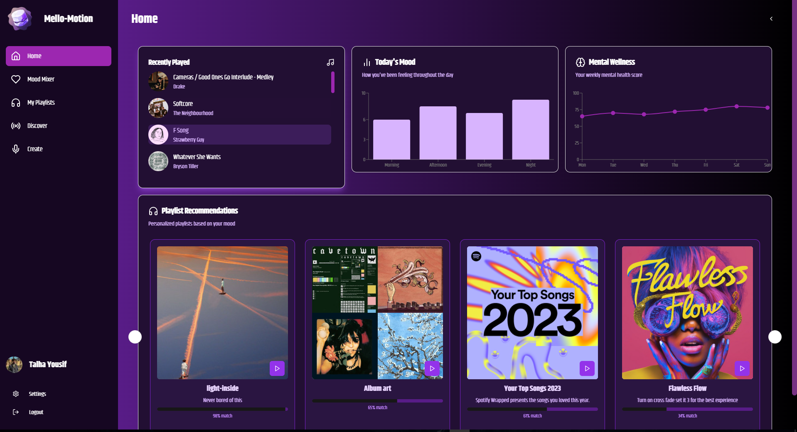

<div align="center">
  
<div align="center">

 

</div>

> Transform your mood into music. A next-generation music curation platform that understands your emotions.

[](https://nextjs.org/)
[](https://www.typescriptlang.org/)
[](https://developer.spotify.com/documentation/web-api/)
[](LICENSE)

</div>

## ✨ Overview

Mello Motion is a revolutionary music curation platform that bridges the gap between emotions and music. Using advanced emotional profiling algorithms and seamless Spotify integration, we deliver personalized music recommendations that match your current mood and emotional state.

## 🎯 Key Features

### 🎭 Emotional Intelligence
- Real-time mood detection and analysis
- Personalized emotional profiling
- Historical mood tracking and patterns

### 🎵 Music Curation
- AI-powered song recommendations
- Mood-based playlist generation
- Spotify integration with your library

### 👤 User Experience
- Customizable user profiles
- Emotional journey timeline
- Favorite tracks and moods tracking
- Social sharing capabilities

### 🎨 Interactive Design
- Stunning 3D visualizations
- Fluid animations and transitions
- Responsive and intuitive interface

## 🚀 Getting Started

### Prerequisites

- Node.js (v16 or higher)
- npm or yarn
- Spotify Developer Account
- Modern web browser

### Installation

1. Clone the repository
```bash
git clone https://github.com/yourusername/mello-motion.git
cd mello-motion
```

2. Install dependencies
```bash
npm install
# or
yarn install
```

3. Set up environment variables
```bash
cp .env.example .env.local
```
Fill in your Spotify API credentials and other required variables.

4. Run the development server
```bash
npm run dev
# or
yarn dev
```

5. Open [http://localhost:3000](http://localhost:3000) in your browser

## 🛠️ Technology Stack

- **Frontend Framework**: Next.js
- **Language**: TypeScript
- **Styling**: 
  - Tailwind CSS
  - Framer Motion
  - Three.js
- **Authentication**: NextAuth.js
- **API Integration**: Spotify Web API
- **State Management**: Zustand
- **Database**: Prisma with PostgreSQL
- **Deployment**: Vercel

## 📱 Screenshots

<div align="center">



</div>

## 📖 Documentation

## 🔐 Environment Variables

```env
SPOTIFY_CLIENT_ID=your_spotify_client_id
SPOTIFY_CLIENT_SECRET=your_spotify_client_secret
NEXTAUTH_SECRET=your_nextauth_secret
DATABASE_URL=your_database_url
```

## 🤝 Contributing

We welcome contributions! Please see our [Contributing Guidelines](CONTRIBUTING.md) for details.

1. Fork the repository
2. Create your feature branch (`git checkout -b feature/AmazingFeature`)
3. Commit your changes (`git commit -m 'Add some AmazingFeature'`)
4. Push to the branch (`git push origin feature/AmazingFeature`)
5. Open a Pull Request

## 📄 License

This project is licensed under the MIT License - see the [LICENSE](LICENSE) file for details.

## 🙏 Acknowledgments

- Spotify Web API
- Next.js Team

